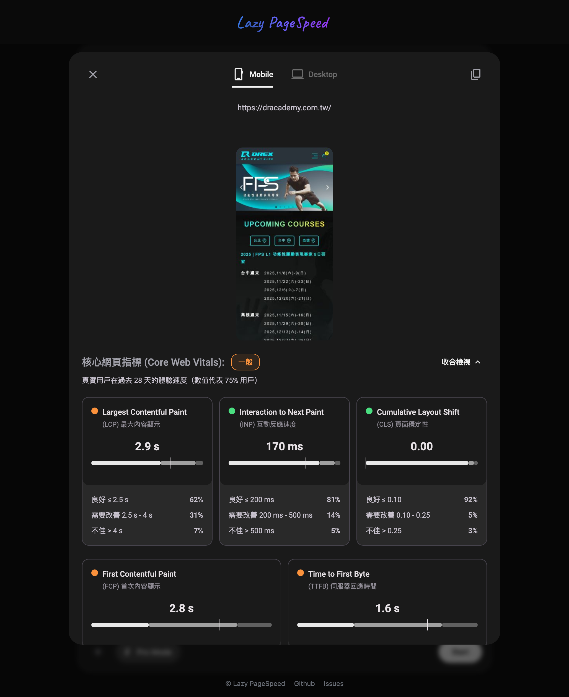

> 天下網頁，唯快不破

Lazy PageSpeed 是 Google PageSpeed Insights API 的增強工具，僅花費極少的時間就能整理好大量網址的分析報告，再交由 AI 整理分析，取代手動操作與整理，用最短的時間取得全面性的完整分析報告。

## 解決什麼問題？

Google PageSpeed Insights 每次只能測一個網址，要優化整個網站、比較多個頁面、或定期追蹤效能時，重複貼網址測試既枯燥又容易出錯，更關鍵的問題是 PageSpeed Insights 網頁沒有下載功能，只能截圖或手動複製關鍵數據來記錄，無法保存完整報告，也就無法把完整資料給 AI 做全局分析，只能根據片段資訊各自判斷。

```
傳統流程：
網址 → PageSpeed Insights 網頁 → 看結果 → 截圖/手動複製 → 無法給 AI 分析
       (每次一個)                   (無法下載)      (片段資訊)
```

Lazy PageSpeed 作為中間層處理這些問題：批次呼叫 API 測試多個網址，將每個網址的龐大原始報告壓縮整理成精簡的 Markdown 檔案，使用者可以逐一貼給 AI 分析，或是整理成一個資料夾再配合提示讓 AI 系統性的總結，完整的 JSON 原始資料也會保留下來，報告能產生分享連結讓團隊協作，API Key 和報告資料都在使用者自己掌控中。

```
Lazy PageSpeed 流程：
多個網址 → Lazy PageSpeed → PageSpeed API → 完整報告下載
          (批次處理)         (自動呼叫)      (JSON + Markdown)
                                                    ↓
                                        ┌───────────┴───────────┐
                                        ↓                       ↓
                                  逐一給 AI               資料夾 + 提示
                                   單頁分析                  系統性總結
```

## 功能特色

- **批次分析**：一次分析多個網址
- **雙模式**：基本模式（最多 3 個網址）/ Pro 模式（無限制，需 API Key）
- **報告下載**：完整 JSON 原始資料 + 精簡 Markdown 格式
- **AI 友善**：壓縮整理後可直接貼給 AI 分析
- **報告分享**：產生分享連結讓團隊協作
- **零信任架構**：API Key 和報告資料都在使用者自己掌控中

## 報告範例



## 快速開始

請參閱 [快速開始](content/01-quick-start.md) 章節。
